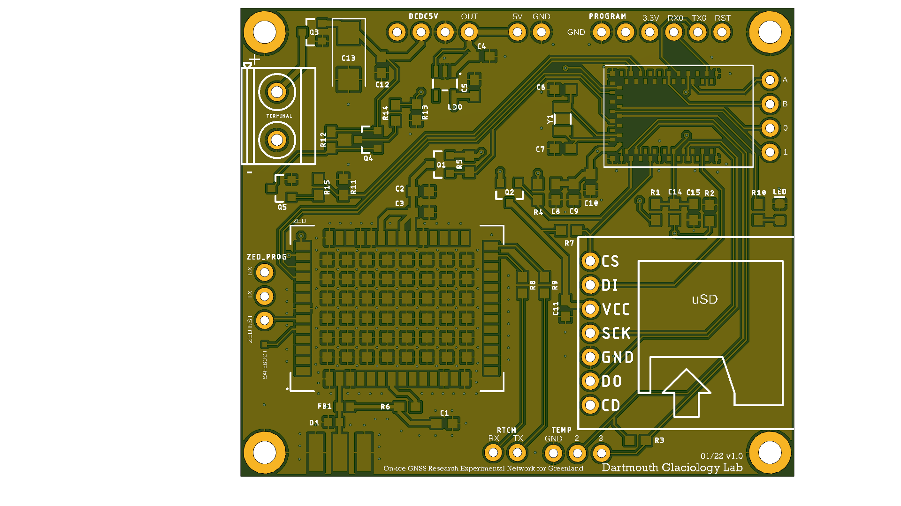

# OGRENet
On-ice Greenland Research Experimental Network :: A low-power, low-cost GNSS raw data logger.

## Overview
Designed for logging raw GNSS data in remote regions of the Arctic, this PCB-software package features a Ublox ZED-F9P and Sparkfun Artemis Module ( Ambiq Apollo3 MCU, Cortex-M4). Input power is from 12V lead acid battery (batteries), although any power supply in the 3.3V-25V range is acceptable with hardware modifications. Nominal current consumption with a 3.3V supply is 45mA (tracking GPS and GLONASS constellations and logging 1Hz data), while consuming 0.07mA during sleep. An on board battery voltage measurement circuit and temperature sensor provide corresponding readings for each GNSS data logging session. Pin-outs and optional peripherals include RX/TX for serial programming, 3-Wire Temperature sensor, an additional I2C bus for peripheral communication and several GPIO pins that can be configured for analog readings, another UART bus, switches, etc. 

 

## How to Use This Software [(Software Files)](OGRENet)

This Software has 4 modes of operation: 
  - (1) Daily Fixed Mode: Log GNSS data every day, starting/ending during USER defined hours
  - (2) Continous Mode: Log GNSS data continously
  - (3) Monthly Mode: Log GNSS data for 24 hours on a specified USER defined day each month
  - (4) Test Mode: Log GNSS data for 50 second intervals, sleep for 50 second intervals
  
OUTPUTs: With all modes, GNSS data is logged to a uSD card in raw .ubx (UBLOX) proprietary format. A debug file is also generated after each log session is closed, reporting the health of the system (temperature, battery health, logging errors, etc.).
  
INPUTs: USERS specify settings in the [CONFIG.txt](OGRENet/CONFIG) file, which, if uploaded to the SD card, will be read into the software. 
Otherwise, software will default to hardcoded values **SPECIFY HERE**

The CONFIG.TXT file is formatted as follows: 

```
LOG_MODE(1: daily fixed, 2: continuous, 3: monthly, 4: test)=2
LOG_START_HOUR_UTC(only if using mode 1)=15
LOG_END_HOUR_UTC(only if using mode 1)=18
LOG_START_DAY(only if using mode 3, 0-28)=5
LED_INDICATORS(0-false, 1-true)=1
MEASURE_BATTERY(0-false, 1-true)=0
ENABLE_GPS(0-false, 1-true)=1
ENABLE_GLO(0-false, 1-true)=0
ENABLE_GAL(0-false, 1-true)=0
ENABLE_BDS(0-false, 1-true)=0
ENABLE_QZSS(0-false, 1-true)=0
ENABLE_NAV_SFRBX((0-false, 1-true)=1
STATION_NUMERIC_NAME(0000)=1234
break;
```

If the USER selects LOG_MODE=1, then LOG_START_HOUR_UTC and LOG_END_HOUR_UTC must be specified. 
If the USER selects LOG_MODE=3, then LOG_START_DAY must also be specified (day of each month GNSS data is logged). 
LED_INDICATORS, if false, will disable all LEDs, excluding those present during initialization. 
MEASURE_BATTERY can be enabled if the user has installed the Battery Circuit and desires battery voltage measurements included in the DEBUG file.
STATION_NUMERIC_NAME is a number between 0001 and 9999, and will be appended to the timestamped file names for each GNSS file. 

OPERATION:  
After plugging in the PCB and inserting the uSD card, the system will attempt to initialize and following LED indicators will flash: 
  - 1 Hz Blinks: System acquiring GPS time and attempting to sync real time clock (Modes 1 and 3).
  - 10 rapid Blinks: System Configuration Complete!
  
 The following indicate failure of initialization: 
  - 2 Blink Pattern: uSD initialization failed - system awaiting automatic reset to try again.
  - 3 Blink Pattern: Ublox initialization failed - system awaiting automatic reset to try again.

Once the system is initialized, it will either sleep or begin logging data, depending on the mode. 
If the USER has enabled LED_INDICATORS, the following additional lights will flash: 
  - Random flashes: System logging GNSS data
  - 1 Blink every 10 seconds: System sleeping

INSTALLATION:
details coming soon...

## How to Use This Hardware [(Hardware Files)](Hardware)

POWER REQUIREMENTS: 
In standard configuration, this system is powered by a 12V lead-acid battery. 
  
While this system is optimized for 12V batteries, input voltage can range from 5.2V to 20V with the following considerations:  
  - The Pololu DC-DC converter minimum input is 5.2V and maximum input is 50V, although aditional power filtering at high voltages required. 
  - The Battery Measurement circuit features a voltage divider circuit that must scale max voltage to 3.3V for the ADC pin. Standard dividers for a 12V battery use 68kOhm and 10kOhm resistors. 
  - The reverse polarity protection system has a limit of 20V. **Do not exeed 20V.**

MATERIALS:
 details coming soon...

HOOKUP GUIDE: 
details coming soon...

## License & Credits
This project is released under the [MIT License](http://opensource.org/licenses/MIT).

Some code for this project adapted from [Sparkfun GNSS Library](https://github.com/sparkfun/SparkFun_u-blox_GNSS_Arduino_Library) and 
[Cryologger Glacier Velocity Tracker](https://github.com/adamgarbo/Cryologger_Glacier_Velocity_Tracker)
